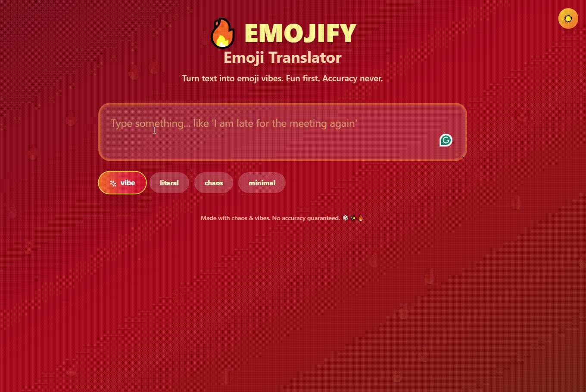

# ✨ Emoji Translator

Turn any text into emoji vibes. Fun first. Accuracy never. 🎲

<!-- Demo GIF -->
<div align="center">
  
  
  
</div>

## What is This?

A playful web app that translates your text into emojis using AI or smart word matching. Perfect for adding some emoji flair to your messages!

## Features

**Free**
- 🎨 **4 Translation Modes** (instant, runs in your browser):
  - **Vibe**: Captures the emotion and feeling (8-12 emojis)
  - **Literal**: One emoji per word
  - **Chaos**: Random fun mix (8-15 emojis)
  - **Minimal**: Exactly 3 emojis that capture the essence
- 🤖 **5 free AI translations** to taste the good stuff
- 🌓 **Dark/Light Theme**, 📋 **Copy & Share**, 🔄 **Shuffle**, 📜 last-5 history
- 🖼️ **Share cards** (with a small watermark)
- 📱 **Responsive**: Works on mobile and desktop

**Pro — $4.90 once (no subscription)**
- ✨ **Unlimited AI translations** in every mode (gpt-4o-mini, context-aware)
- 🔥 **Personality modes**: Roast, Gen Z 💅, Flirty 😏, Passive-Aggressive 🙂, Emoji Story 📖
- 🖼️ **Clean share cards** — no watermark
- 📜 **Unlimited saved history**

No accounts — buyers get a license key by email and paste it in once. See [SETUP-MONETIZATION.md](./SETUP-MONETIZATION.md) for how to go live.

## How to Use

1. **Type your text** in the text area (e.g., "I am late for the meeting again")
2. **Choose a mode** (Vibe, Literal, Chaos, or Minimal)
3. **See your emojis** appear instantly
4. **Copy, Share, or Shuffle** as needed!

## Installation

### 1. Install Dependencies

```bash
npm install
```

### 2. Setup the AI Backend (Optional for local dev)

Local translation works with no setup at all. The ✨ AI Translate button and Pro features are served by serverless functions in `functions/api/` — the OpenAI key lives **server-side only** (never in the client bundle).

For local development with the API:

```bash
# .dev.vars (gitignored)
OPENAI_API_KEY=sk-...
LEMONSQUEEZY_STORE_ID=...
LEMONSQUEEZY_PRODUCT_ID=...

npx wrangler pages dev -- npm run dev
```

Full deployment + payments walkthrough: [SETUP-MONETIZATION.md](./SETUP-MONETIZATION.md).

### 3. Run the App

```bash
npm run dev
```

Open [http://localhost:5173](http://localhost:5173) in your browser.

## Build for Production

```bash
npm run build
```

The built files will be in the `dist` folder.

## How It Works

### Translation Flow

1. **Live typing** always uses the free local engine: verbs/nouns/adjectives extracted with NLP, matched against a 1000+ word emoji database, fuzzy search for typos, sentiment analysis for mood emojis.
2. **✨ AI Translate** (explicit button) calls `POST /api/translate`, a serverless function that proxies OpenAI gpt-4o-mini with a mode-specific prompt. Free users get 5 tries; after that it requires a Pro license key, which the server verifies against Lemon Squeezy on every request (cached).
3. **Personality modes** (Roast, Gen Z, Flirty, Passive-Aggressive, Story) are AI-only and Pro-only — enforced server-side.

## Examples

- "I am late for the meeting again" → ⏰🚨💼📅😤
- "Happy birthday!" → 🎂🎉🎈🎊✨
- "I love pizza" → ❤️🍕😍

## License

MIT
